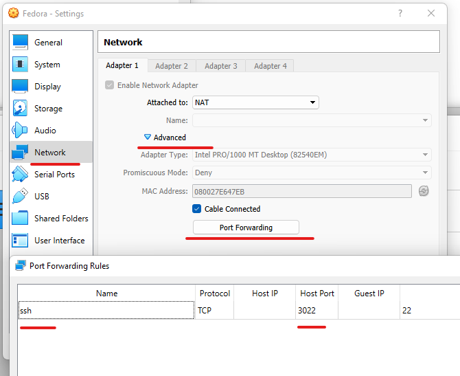

# remote-ssh
Setup remote SSH connection.  
It shares secure key file between client and remote server.  
And adds alias in your local machine. 

```bash
# make sure that you have 'openssh-server' installed
systemctl start sshd.service
systemctl enable sshd.service
# check your ip
ip a
```

## Example on connect to VirtualBox machine

```powershell
.\setup.ps1 debian user localhost 3022
# syntax args: <alias> <login> <target IP> <target PORT>
```

## Share drives
```bash
# share drive G to vm
sudo usermod -aG vboxsf $USER
sudo ln -s /media/sf_G_DRIVE /vm
```
